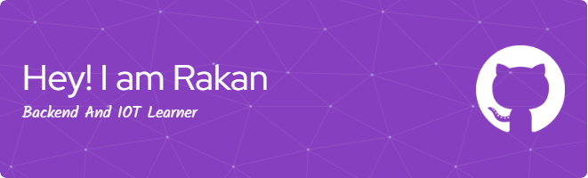

  

  

 

## 💼 Hi there, I'm Muhammad Rakan Atha! 👋

_Backend Developer | IoT Enthusiast | Python & Laravel Developer_

I'm an enthusiastic backend developer and IoT learner, currently studying at **Telkom University Purwokerto**. I have a strong passion for building scalable backend systems and exploring the world of IoT. I enjoy learning new technologies and continuously improving my skills.

---

## 🛠️ Skills & Tech Stack

  
  
  
  
  
  
  
  
  
  
  

**Backend:** Python, Laravel, PHP  
**IoT:** Prototyping, Integration, Automation  
**Development:** REST API, Database Design, System Architecture  
**Tools:** VS Code, Moodle, DBeaver, Arduino IDE  
**Currently Learning:** Advanced Backend Patterns, IoT Device Integration

---

## 🎯 Current Focus / Goals

### 🌟 Learning Journey

💻 Deepening backend development skills - Python, Laravel, PHP  
🔌 Exploring IoT - Device integration, automation, and prototyping  
🗄️ Database Management - Efficient data storage and retrieval  
⚡ Performance Awareness - Writing clean, efficient, and scalable code

### 🚀 Short Term Goals

- Build more backend and IoT projects to strengthen my skills
- Create a comprehensive portfolio showcasing my work
- Learn new frameworks and tools to expand my capabilities
- Collaborate with others and contribute to open-source

### 🌍 Long Term Vision

- Become a proficient Backend & IoT Developer
- Deepen my expertise in scalable systems and IoT solutions
- Mentor and share knowledge with others
- Build impactful technology for real-world problems

---

## 🌐 Find Me Elsewhere

  
  
  
  
  

---

## 📊 GitHub Stats

  

---

  
  ### 👀 Profile Views
  
  
  

  
  *"The only way to learn a new programming language is by writing programs in it." - Dennis Ritchie*
  

